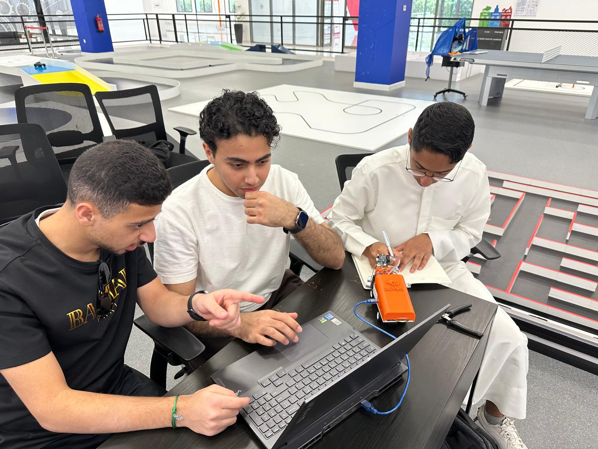
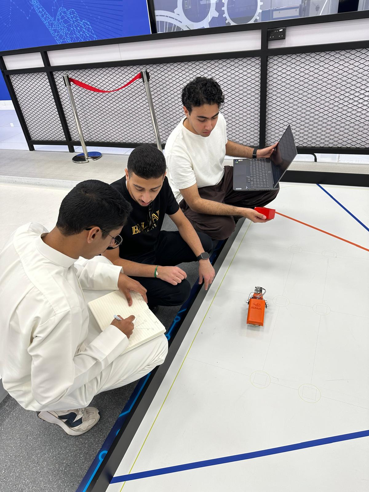
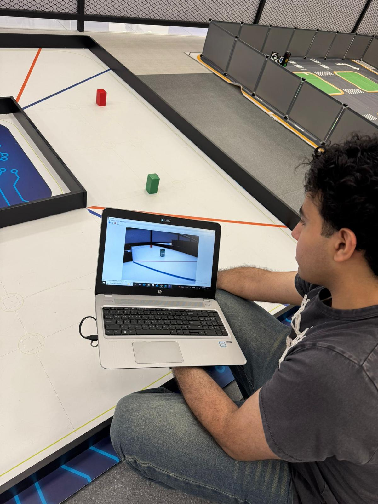

<div align="center">


# The Motions
### Self-Driving Robot Car — WRO Future Engineers 2026
Kuwait National Qualifier


*Two side sensors, one color camera, and a disciplined PD loop — three laps, nothing touched.*

</div>

---

**Contents** &nbsp;
[Snapshot](#snapshot) ·
[I. The Machine](#i-the-machine) ·
[II. The Logic](#ii-the-logic) ·
[III. Proof](#iii-proof) ·
[IV. The Crew](#iv-the-crew)

---

## Snapshot

The Motions enters the **WRO Future Engineers 2026** category with a small 1:28-scale car that drives itself. Set it on a walled track scattered with colored pillars, give it a single start signal, and it has to finish three back-to-back laps — holding the middle of the lane and respecting which side of every pillar it must pass — without any help.

We kept the build intentionally minimal: **two ultrasonic sensors** read the walls, **one Pixy2 camera** makes the color calls, and a single Arduino Uno ties them together through a well-damped PD controller. Fewer parts means less to go wrong and a loop we trust to repeat itself lap after lap.

| Quick facts | |
|---|---|
| Controller | Arduino Uno (ATmega328P · 16 MHz) |
| Drive | Brushed DC motor via Cytron MD13S (RWD) |
| Steering | Front servo, Ackermann |
| Sensing | 2× HC-SR04 + Pixy2 camera |
| Power | 7.4 V 2S LiPo |
| Size / mass | ~17 × 9 × 7 cm · ~0.5 kg (within limits) |

```
┌──────────────────────────────────────────────────────────┐
│                 Arduino Uno  (ATmega328P)                 │
│                                                          │
│   HC-SR04 Left  ─┐                                       │
│                  ├─→  PD core  ──→  Mode manager ──┐     │
│   HC-SR04 Right ─┘                                  │     │
│                                                     ▼     │
│   Pixy2 camera ───────────────────────→  Servo (A0)      │
│                                          Cytron MD13S ──→ DC motor
└──────────────────────────────────────────────────────────┘
```

Two behaviors lean on that core: **PD mode** keeps the car centered from the ultrasonics by default, and **Pixy mode** lets vision take the wheel the instant a trained pillar color is locked on.

---

## I. The Machine

### Components

| # | Component | Specification | Function |
|---|-----------|---------------|----------|
| 1 | Microcontroller | Arduino Uno (ATmega328P, 16 MHz) | Central processing & I/O |
| 2 | Motor Driver | Cytron MD13S | Speed & direction control |
| 3 | Drive Motor | Brushed DC — 7.4 V | Rear-wheel propulsion |
| 4 | Steering Servo | Standard 180° servo | Front Ackermann steering |
| 5 | Distance Sensors | HC-SR04 × 2 | Left & right wall detection |
| 6 | Vision Sensor | Pixy2 (SPI) | Color pillar recognition |
| 7 | Battery | 7.4 V LiPo 2S | Full-system power |
| 8 | Chassis | WLtoys 284010 (1:28) | Compact RC platform |

> **Footprint** — about 17 × 9 × 7 cm and roughly 0.5 kg, leaving plenty of margin under the 30 × 20 × 30 cm / 1.5 kg ceilings.

<div align="center">

<br/><sub>Robot component layout</sub>
</div>

### Power & Wiring

```
LiPo 7.4 V
    ├──→ Cytron MD13S ──→ DC motor
    └──→ Arduino Vin
              └──→ 5 V rail ──→ Servo · HC-SR04 ×2 · Pixy2
```

<details>
<summary><b>Full pin mapping</b> (click to expand)</summary>

<br/>

| Component | Signal | Pin | Notes |
|-----------|--------|-----|-------|
| HC-SR04 Left | TRIG / ECHO | D4 / D5 | trigger pulse · echo timing |
| HC-SR04 Right | TRIG / ECHO | D2 / D9 | trigger pulse · echo timing |
| Steering Servo | SIG | A0 | PWM steering output |
| Cytron MD13S | PWM / DIR | D3 / D8 | speed · direction |
| Pixy2 Camera | CS · MOSI · MISO · SCK | D10 · D11 · D12 · D13 | SPI bus |

</details>

📄 **[Full wiring diagram (PDF)](Schemes/Schematic_Wiring_Diagram.pdf)**

<div align="center">

<br/><sub>Development tools and lab setup</sub>
</div>

### Printed Parts

The chassis starts as a WLtoys 284010 (1:28-scale) RC base, then gets custom 3D-printed brackets that hold every board and sensor in place.

> **Print settings** — PLA · 20% infill · 0.2 mm layers.

<div align="center">

<br/><sub>3D-printed electronics tray and sensor mounts</sub>
</div>

Printable files live in [`Models/`](Models/).

### Six Views

<div align="center">
<table>
  <tr>
    <td align="center"><br/><sub><b>Front</b></sub></td>
    <td align="center"><br/><sub><b>Back</b></sub></td>
    <td align="center"><br/><sub><b>Left</b></sub></td>
  </tr>
  <tr>
    <td align="center"><br/><sub><b>Right</b></sub></td>
    <td align="center"><br/><sub><b>Top</b></sub></td>
    <td align="center"><br/><sub><b>Bottom</b></sub></td>
  </tr>
</table>
</div>

---

## II. The Logic

Everything runs in **C/C++** through the Arduino IDE. Both sketches share one PD core:

| Module | File | Description |
|--------|------|-------------|
| Open Challenge | `Open_Challenge.ino` | wall-following only — PD + anti-zigzag |
| Obstacle Challenge | `Obstacle_Challenge.ino` | wall-following plus Pixy2 mode switching |

### Control Core

One pass of the loop is the same nine steps, every time:

```
1.  sample HC-SR04 left + right  (3 readings averaged each)
2.  cap anything beyond MAX_VALID_CM = 75 cm
3.  error = leftDist − rightDist
4.  treat |error| < 0.8 cm as zero          (deadband)
5.  derivative = LPF(error − lastError),  α = 0.45
6.  output = KP·error + KD·derivative
7.  targetAngle = CENTER_ANGLE + output
8.  servoAngle = LPF(targetAngle),  α = 0.55
9.  back off the throttle if |servoAngle − CENTER| > 28°
```

<details>
<summary><b>Tuned parameters</b> (click to expand)</summary>

<br/>

| Parameter | Value | Purpose |
|-----------|-------|---------|
| `KP` | 0.10 | proportional gain — centering strength |
| `KD` | 0.09 | derivative gain — oscillation damping |
| `MOTOR_SPEED` | 55 | cruise PWM (0–255) |
| `TURN_SPEED` | 45 | reduced speed on sharp turns |
| `CENTER_ANGLE` | 90° | servo straight-ahead |
| `ERROR_DEADBAND` | ±0.8 cm | noise suppression band |
| `DERIV_ALPHA` | 0.45 | derivative low-pass coefficient |
| `SERVO_ALPHA` | 0.55 | servo output smoother |
| `MAX_VALID_CM` | 75 cm | corner-spike rejection |
| `HARD_TURN_DEG` | 28° | speed-reduction trigger |

</details>

### Staying Centered

Driving one straight line is trivial; stitching a whole clean lap together is the hard part. Six anti-zigzag measures hold the car on the centerline:

| Measure | How | Why it matters |
|---------|-----|----------------|
| Error deadband | drop anything within ±0.8 cm | filters out tiny sensor jitter |
| Derivative LPF | α = 0.45 | tames sudden spike-driven swings |
| Servo smoothing | α = 0.55 | stops the steering from twitching |
| Corner clamping | reject readings over 75 cm | ignores phantom long-range echoes |
| Adaptive speed | slow down past 28° of turn | keeps it from overshooting curves |
| Sensor fallback | copy the working side | carries on if one sensor drops out |

### Reading Pillars

The Pixy2 learns two color signatures under the arena's own lighting, and every pillar tells the car which way to go around it:

| Pillar | Signature | WRO rule | Response |
|--------|-----------|----------|----------|
| 🟢 Green | Sig 1 | pass on the **left** | steer left, servo > 90° |
| 🔴 Red | Sig 2 | pass on the **right** | steer right, servo < 90° |

<details>
<summary><b>Steering lookup by pillar position</b> (click to expand)</summary>

<br/>

| Color | X &lt; 120 px | X 120–170 px | X &gt; 170 px |
|-------|-----------|--------------|-----------|
| 🟢 Green | hard left — 135° | medium left — 120° | soft left — 105° |
| 🔴 Red | soft right — 75° | medium right — 60° | hard right — 45° |

</details>

A hysteresis manager decides when wall-following hands over to vision, so the two modes never tug against each other:

```
detection filter :  area ≥ 200 px²  ·  X within 20–300 px
enter Pixy mode  :  2 valid frames in a row
exit to PD mode  :  3 missed frames in a row
minimum hold     :  280 ms
servo slew limit :  6° per step
```

---

## III. Proof

### Calibration

| Test | Method | Outcome |
|------|--------|---------|
| Ultrasonic accuracy | compared against a ruler at set distances | `MAX_VALID_CM` fixed at 75 cm |
| Servo center | drove straight and aligned by eye | `CENTER_ANGLE` = 90° |
| Motor dead zone | swept PWM up to first movement | `MOTOR_SPEED` = 55 |
| PD field tuning | adjusted KP/KD lap by lap | KP = 0.10, KD = 0.09 |
| Pixy2 training | captured signatures in arena light | Sigs 1 & 2 trained |
| Anti-zigzag | swept the filter coefficients | oscillation gone |
| 3-lap validation | full run on a WRO-spec track | ✅ completed |
| Pillar avoidance | tried every color × position | ✅ no collisions |

### Performance

| Metric | Result |
|--------|--------|
| Three-lap completion | ✅ steady, repeatable times |
| Wall-centering deviation | under 2 cm on straights |
| Pillar recognition | above 95% in arena lighting |
| Obstacle avoidance | ✅ smooth, never made contact |
| Mode switching | ✅ clean PD ↔ Pixy handoffs |

### On Video

| Challenge | Description | File |
|-----------|-------------|------|
| Open Challenge | three autonomous wall-following laps | [`videos/Open_Challenge.mp4`](videos/) |
| Obstacle Challenge | complete pillar detection + avoidance | [`videos/Obstacle_Challenge.mp4`](videos/) |

---

## IV. The Crew

<div align="center">
<table>
  <tr>
    <td align="center"></td>
    <td align="center"></td>
    <td align="center"></td>
  </tr>
  <tr><td colspan="3" align="center"><sub>The Motions at the AUM robotics lab — writing code, tuning, and running the car on the arena.</sub></td></tr>
</table>
</div>

<div align="center">

| Member | Responsibility |
|--------|----------------|
| **Abdullah Al-Otaibi** · عبدالله العتيبي | Hardware design · System integration |
| **Daoud Al-Aneizi** · داود العنيزي | Software development · PD controller |
| **Yousef Al-ostath** · يوسف الاستاد | Vision system · Testing & calibration |

</div>

---

<div align="center">

**The Motions · Digital Innovations**
*Kuwait · WRO Future Engineers 2026*

</div>
